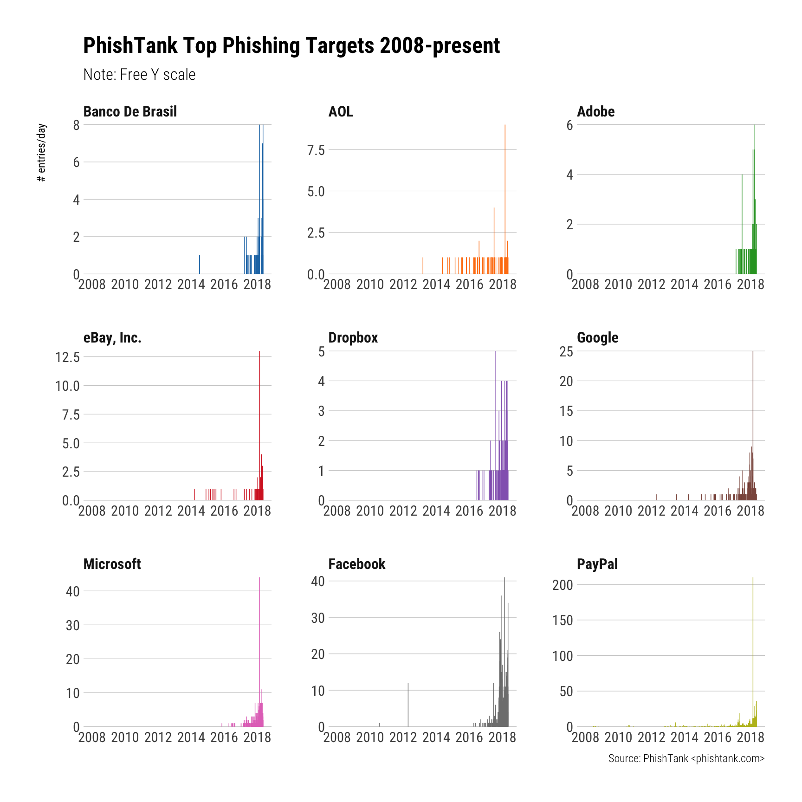

# aquarium

Validate ‘Phishing’ ‘URLs’ with the ‘PhishTank’ Service

## Description

‘PhishTank’ \<www.phishtank.com\> is a free community site where anyone
can submit, verify, track and share ‘phishing’ data. Methods are
provided to test if a ‘URL’ is classsified as a ‘phishing’ site and to
download aggregated ‘phishing’ ‘URL’ databases.

## What’s Inside The Tin

The following functions are implemented:

  - `pt_check_url`: Check an individual URL against PhishTank’s database
  - `pt_read_db`: Retrieve a complete copy of the current PhishTank
    database

## Installation

``` r
devtools::install_github("hrbrmstr/aquarium")
```

## Usage

``` r
library(aquarium)
library(hrbrthemes)
library(tidyverse)

# current verison
packageVersion("aquarium")
```

    ## [1] '0.1.0'

### Test a URL

``` r
x <- pt_check_url("http://www.seer.revpsi.org/hhh/1/")

x
```

    ## # A tibble: 1 x 11
    ##   timestamp           serverid status requestid  url   in_database phish_id phish_detail_pa… verified verified_at valid
    ##   <dttm>              <chr>    <lgl>  <chr>      <chr> <chr>       <chr>    <chr>            <lgl>    <chr>       <lgl>
    ## 1 2018-05-06 12:54:41 a8fc4c9b NA     172.31.97… http… TRUE        5604930  http://www.phis… TRUE     2018-04-27… TRUE

``` r
glimpse(x)
```

    ## Observations: 1
    ## Variables: 11
    ## $ timestamp         <dttm> 2018-05-06 12:54:41
    ## $ serverid          <chr> "a8fc4c9b"
    ## $ status            <lgl> NA
    ## $ requestid         <chr> "172.31.97.117.5aef3351720d56.76914316"
    ## $ url               <chr> "http://www.seer.revpsi.org/hhh/1/"
    ## $ in_database       <chr> "TRUE"
    ## $ phish_id          <chr> "5604930"
    ## $ phish_detail_page <chr> "http://www.phishtank.com/phish_detail.php?phish_id=5604930"
    ## $ verified          <lgl> TRUE
    ## $ verified_at       <chr> "2018-04-27T19:38:43+00:00"
    ## $ valid             <lgl> TRUE

### Get the databases

``` r
x <- pt_read_db(.progress = FALSE)

x
```

    ## # A tibble: 32,384 x 9
    ##    phish_id url               phish_detail_url   submission_time     verified verification_time   online details target
    ##  * <chr>    <chr>             <chr>              <dttm>              <chr>    <dttm>              <chr>  <list>  <chr> 
    ##  1 5616132  http://maiscredi… http://www.phisht… 2018-05-06 12:22:54 yes      2018-05-06 12:24:36 yes    <data.… Other 
    ##  2 5616116  https://casasbha… http://www.phisht… 2018-05-06 11:59:51 yes      2018-05-06 12:00:29 yes    <data.… Other 
    ##  3 5616101  http://casasbaia… http://www.phisht… 2018-05-06 11:38:27 yes      2018-05-06 11:39:15 yes    <data.… Other 
    ##  4 5616089  http://qemahost.… http://www.phisht… 2018-05-06 10:41:47 yes      2018-05-06 11:27:07 yes    <data.… Other 
    ##  5 5616085  http://matematic… http://www.phisht… 2018-05-06 10:41:23 yes      2018-05-06 11:25:29 yes    <data.… Other 
    ##  6 5616072  http://www.realt… http://www.phisht… 2018-05-06 10:40:40 yes      2018-05-06 11:30:09 yes    <data.… Other 
    ##  7 5616070  https://siensafr… http://www.phisht… 2018-05-06 10:40:30 yes      2018-05-06 11:31:43 yes    <data.… Other 
    ##  8 5616069  http://siensafri… http://www.phisht… 2018-05-06 10:40:29 yes      2018-05-06 11:27:07 yes    <data.… Other 
    ##  9 5616067  http://realtypro… http://www.phisht… 2018-05-06 10:40:25 yes      2018-05-06 11:27:07 yes    <data.… Other 
    ## 10 5616060  http://catclaw.b… http://www.phisht… 2018-05-06 10:00:06 yes      2018-05-06 10:51:36 yes    <data.… Other 
    ## # ... with 32,374 more rows

``` r
glimpse(x)
```

    ## Observations: 32,384
    ## Variables: 9
    ## $ phish_id          <chr> "5616132", "5616116", "5616101", "5616089", "5616085", "5616072", "5616070", "5616069", "...
    ## $ url               <chr> "http://maiscreditoaqui.com/produto.php?linkcompleto=smart-tv-led-curva-49-samsung-4k-ult...
    ## $ phish_detail_url  <chr> "http://www.phishtank.com/phish_detail.php?phish_id=5616132", "http://www.phishtank.com/p...
    ## $ submission_time   <dttm> 2018-05-06 12:22:54, 2018-05-06 11:59:51, 2018-05-06 11:38:27, 2018-05-06 10:41:47, 2018...
    ## $ verified          <chr> "yes", "yes", "yes", "yes", "yes", "yes", "yes", "yes", "yes", "yes", "yes", "yes", "yes"...
    ## $ verification_time <dttm> 2018-05-06 12:24:36, 2018-05-06 12:00:29, 2018-05-06 11:39:15, 2018-05-06 11:27:07, 2018...
    ## $ online            <chr> "yes", "yes", "yes", "yes", "yes", "yes", "yes", "yes", "yes", "yes", "yes", "yes", "yes"...
    ## $ details           <list> [<66.147.240.159, 66.147.240.0/20, 46606, arin, US, 2018-05-06T16:23:51+00:00>, <192.254...
    ## $ target            <chr> "Other", "Other", "Other", "Other", "Other", "Other", "Other", "Other", "Other", "Other",...

### Top Phishing Targets

``` r
filter(x, verified == "yes") %>% 
  count(day = as.Date(verification_time), target) -> targets

count(targets, target, sort=TRUE) %>%
  filter(target != "Other") %>% 
  head(9) -> top_named_targets

filter(targets, target %in% top_named_targets$target) %>% 
  mutate(target = factor(target, levels=rev(top_named_targets$target))) %>% 
  ggplot(aes(day, n, group=target, color=target)) +
  geom_segment(aes(xend=day, yend=0), size=0.25) +
  scale_x_date(name = NULL, limits=as.Date(c("2008-01-01", "2018-06-31"))) +
  scale_y_comma(name = "# entries/day") +
  ggthemes::scale_color_tableau() +
  facet_wrap(~target, scales="free") +
  labs(
    title = "PhishTank Top Phishing Targets 2008-present",
    subtitle = "Note: Free Y scale",
    caption = "Source: PhishTank <phishtank.com>"
  ) +
  theme_ipsum_rc(grid="Y", strip_text_face = "bold") +
  theme(legend.position="none")
```



## Code of Conduct

Please note that this project is released with a [Contributor Code of
Conduct](CONDUCT.md). By participating in this project you agree to
abide by its terms.
